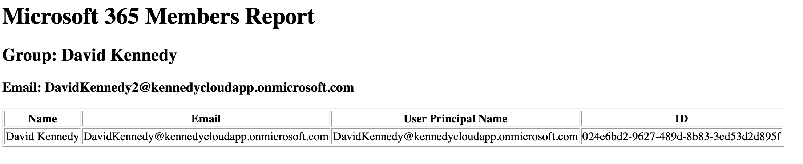

# Microsoft 365 Group Membership Reporter

A Python application that connects to Microsoft Graph using OAuth 2.0 (Client Credentials Flow) to retrieve Microsoft 365 groups and their members. The application allows the user to select a group, retrieves its members, exports the results to CSV, generates an HTML report, and emails the report using Microsoft Graph.

---

## Features

- Authenticate with Microsoft Entra ID using MSAL
- Retrieve Microsoft 365 groups from Microsoft Graph
- Select a group from the terminal
- Retrieve members of the selected group
- Display member information in the terminal
- Export member data to CSV
- Generate an HTML report
- Send the report via Microsoft Graph

---

## Technologies Used

- Python 3
- Microsoft Graph API
- Microsoft Entra ID
- MSAL
- Requests
- HTML
- CSV

---

## Project Structure

```text
m365_group_membership_reporter/
├── images/
├── reports/
├── src/
│   ├── auth.py
│   ├── groups.py
│   ├── members.py
│   ├── display.py
│   ├── exports.py
│   ├── html_report.py
│   └── mailer_graph.py
├── main.py
├── requirements.txt
└── README.md
```

---

## Workflow

1. Authenticate with Microsoft Entra ID.
2. Retrieve Microsoft 365 groups.
3. Display available groups.
4. Select a group from the terminal.
5. Retrieve members of the selected group.
6. Display member information.
7. Export the data to CSV.
8. Generate an HTML report.
9. Email the report using Microsoft Graph.

## Screenshots

### Terminal Output


### HTML Report



### Email Report


## Skills Demonstrated

- OAuth 2.0 Client Credentials Flow
- Microsoft Graph API integration
- REST API development
- JSON parsing
- Working with multiple Graph endpoints
- Passing data between Python functions
- User interaction using terminal input
- Modular Python programming
- CSV report generation
- HTML report generation
- Email automation with Microsoft Graph

---

## Example Output

The application produces:

- Interactive terminal group selection
- Terminal summary of group members
- CSV report (`members.csv`)
- HTML report (`members.html`)
- HTML email sent using Microsoft Graph

---

## Future Improvements

- Display group owners
- Retrieve nested group memberships
- Export to Excel
- Improve HTML styling with CSS
- Add automated scheduling
- Build a Flask web interface
