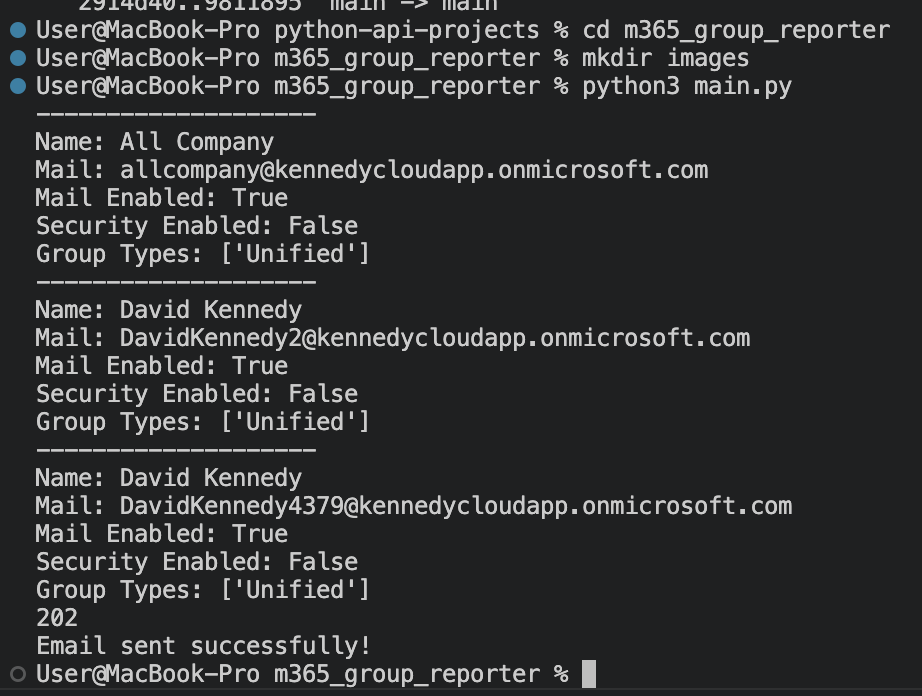
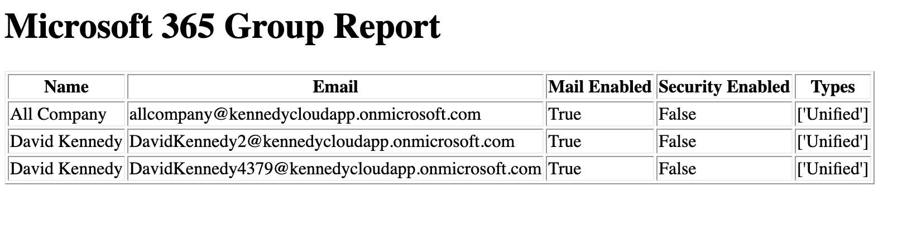
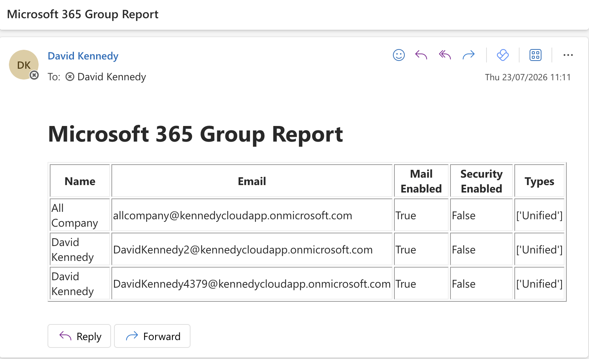

# Microsoft 365 Group Reporter

A Python application that connects to Microsoft Graph using OAuth 2.0 (Client Credentials Flow) to retrieve Microsoft 365 group information. The application exports the results to CSV, generates an HTML report, and emails the report using Microsoft Graph.

---

## Features

- Authenticate with Microsoft Entra ID using MSAL
- Retrieve Microsoft 365 groups from Microsoft Graph
- Display group information in the terminal
- Export group data to CSV
- Generate an HTML report
- Send the HTML report via Microsoft Graph

---

## Technologies Used

- Python 3
- Microsoft Graph API
- Microsoft Entra ID
- MSAL
- Requests
- HTML
- CSV

---

## Project Structure

```text
m365_group_reporter/
├── reports/
├── src/
│   ├── auth.py
│   ├── groups.py
│   ├── display.py
│   ├── exports.py
│   ├── html_report.py
│   └── mailer_graph.py
├── main.py
├── requirements.txt
└── README.md
```

---

## Workflow

1. Authenticate with Microsoft Entra ID.
2. Request group information from Microsoft Graph.
3. Parse the JSON response.
4. Display the groups in the terminal.
5. Export the data to a CSV file.
6. Generate an HTML report.
7. Email the report using Microsoft Graph.

---

## Terminal Output



### HTML Report



### Email Report



## Skills Demonstrated

- OAuth 2.0 Client Credentials Flow
- Microsoft Graph API integration
- REST API development
- JSON parsing
- Modular Python programming
- CSV report generation
- HTML report generation
- Email automation with Microsoft Graph

---

## Example Output

The application produces:

- Terminal summary of Microsoft 365 groups
- CSV report (`groups.csv`)
- HTML report (`groups.html`)
- HTML email sent using Microsoft Graph

---

## Future Improvements

- Filter groups by type
- Include group owners and members
- Export to Excel
- Add CSS styling to the HTML report
- Schedule automated report generation
